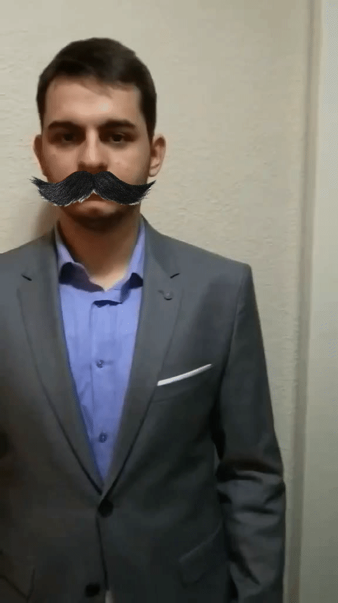
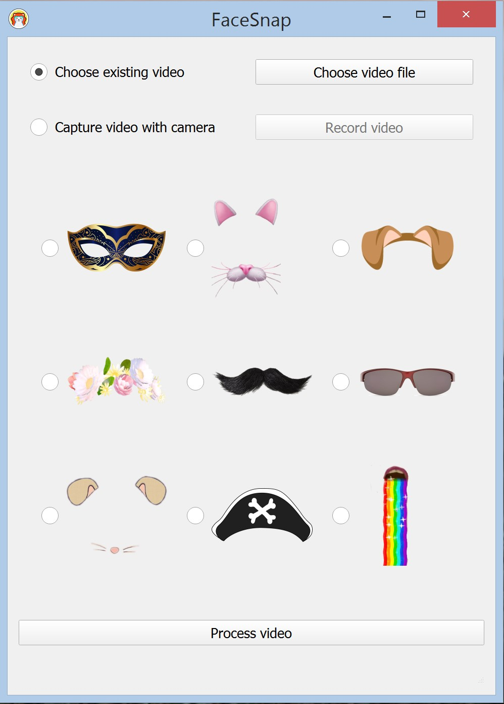
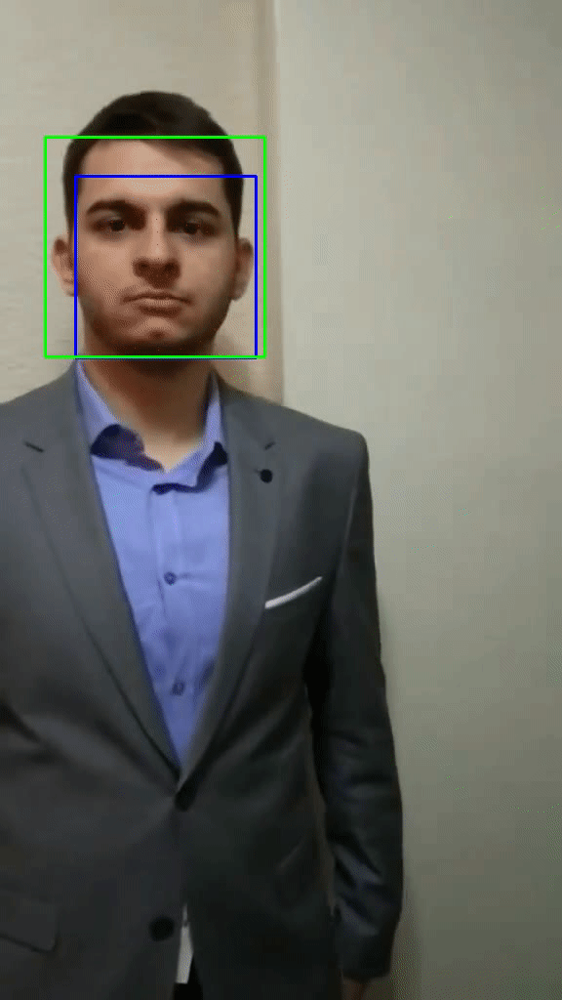

# FaceSnap

## What is FaceSnap?
FaceSnap is a python (version **3.5**) desktop application developed in
JetBrains PyCharm IDE. It was designed and constructed as a project at Faculty
of Technical Science in subject Soft Computing 2018/2019.
Developers of this application are:

    1. Bojana Ivanovic  SW5/2015
    2. Vanja Mijatov    SW13/2015

Application processes video provided by user and detects faces which can allow
attaching stickers to faces in order to create funny and interesting videos.
In addition, application can be used for evaluating (statistical and empirical)
algorithms that are implemented by developers and used libraries.

## Phases in application workflow

    1. Run application
    2. Video and sticker choice
    3. Detecting faces using dlib
    4. Attaching sticker to faces
    5. Detecting faces using OpenCV
    6. Saving result video
    7. Providing statistics about detection success
    8. Showing result video

### 1. Run application
Application could be run normally as standard python application, from IDE or
from the command line. In addition, there are two combinations of optional
arguments that could be provided. First combination consists of one parameter
and second combination consists of two parameters. First parameter (of both 
combinations) is used to inform application whether to draw rectangles that wrap
detected faces and 68 key points on the face used for detecting parts of the
face (landmarks). Value of this argument could be either *true* or *false*
(case-insensitive). Second argument of second combination informs application
how many faces should be detected in each frame. This argument is, as first one,
used for evaluating success of detection phase and would result in calculating
statistical success of detection and printing it in console. Value of this
argument could be *any positive integer value*.

### 2. Video and sticker choice
After running application, main window is visible. In this window user could
choose which video would be processed and which (if any) sticker would be
attached. Video could be pre-existing or could be recorded using camera. User
receives feedback about actions in status bar at bottom of screen
so information about every phase and possible errors would be visible.

#### Choosing pre-existing video
Video in any format that exists on user's computer could be chosen for
processing. If chosen video is damaged or could not be read or processed, user
would be informed through status bar. Choosing pre-existing video would result
in having result video with same screen size and frequency per second (fps) as
provided video after the last phase if each of phases were done successfully.

#### Recording video with camera
Video could be recorded using camera attached to user's computer. This video
would be saved on user's computer on location that user provides. When screen
showing live camera feed appears, after a short countdown (which is printed in 
the console), application would start recording a short video. Then, main window
would appear again and would allow the user to process recorded video.

### 3. Detecting faces using dlib
Dlib is a library that provided face and facial landmarks detection using
algorithm Histogram of Oriented Gradients (HOG) and 68 point model. Histogram of
Oriented Gradients is an algorithm that consists of several phases. During
first phase, gradient are calculated. In the second phase, frame is divided in
cells with size NxN and is next phase histogram of gradients is calculated for
every cell. Later, the histogram is normalised. In the last phase, result
vectors are concatenated in order to get representation of whole image. At the
end, using model that application has, faces and facial landmarks are detected
in each frame.

### 4. Attaching sticker to faces
Based on facial landmarks, chosen sticker would be attached to faces. Different
stickers cover different parts of faces. Success of covering parts of face is
calculated using Intersection over Union (IoU) algorithm. Idea of this algorithm
is to show how much two different areas match and provides calculation how well
is the match of positions of those two areas.

### 5. Detecting faces using OpenCV
OpenCV is a library that is widely used in computer vision and one of it's many
tools is face detection using Haar Cascades, based on Viola-Jones object
detection method. Firstly, haar features are used to try detecting face parts
with few common properties that each human face contains. Then, features
which are extracted are evaluated using integral image and after that the best
features are selected using Adaboost method. At the end, classification is done
via cascade and faces are detected.

### 6. Saving result video
Every frame of video is processed and the result image for each frame is
generated and saved to result video file in the directory where input video is
located. Saved video has same frequency per second (fps) and screen size as
input video. The result video is saved in .avi video format.

### 7. Providing statistics about detection success
As mentioned, if second command line argument is provided, it would be
calculated how successful were dlib and OpenCV libraries in detecting correct
amount of faces in each frame. Second type of statistics provided is calculation
of Intersection over Union (IoU) which tells how successful was the coverage of
part of the face with the chosen sticker.

### 8. Showing result video
After all previous phases are successfully done, result video is shown. After
this last step, main window is shown again and some other video could be
processed.

## Concluded results about used approaches in application 
Algorithms implemented by dlib and OpenCV have different approaches and their
success in detections is much different. After evaluating results generated
based on testing done on different samples (with different number of faces,
different brightness, with faces in motion) it is concluded that dlib is
much accurate when detecting faces than OpenCV. Dlib has success ratio over 90%
which is significantly higher that OpenCV's approach which showed average
results around 70%. Accuracy of dlib allowed better detecting face parts and
therefore more accurate covering face parts with stickers. On the other hand,
processing time is much higher for dlib. After testing on different machines,
it was concluded that dlib required sometimes even more than 100 times more time
for every frame while OpenCV was so fast that if was almost real time. Despite
having much better performance when it comes to time consumption, developers
chose to use dlib for detecting face parts because of much higher accuracy which
allowed much better coverage of face parts with stickers. Using Intersection
over Union (IoU) algorithm, it was shown that attaching stickers to parts of
faces has average accuracy higher than 90%.